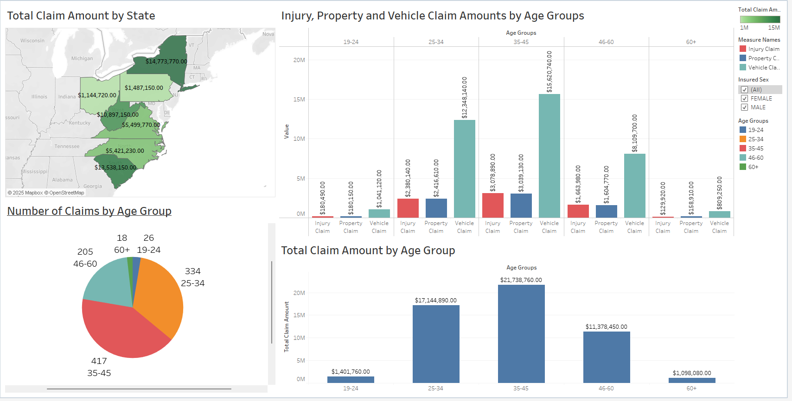

# Insurance Claims Analysis
## Description 
This analysis provides an understanding of claim distribution and demographic patterns, designed to inform strategic decisions for risk assessment.
This dashboard provides a clear overview of insurance claim distribution across age, gender, and location [Pennsylvania, South Carolina, West Virginia, North Carolina, Ohio, and New York] of 1000 insurance claim records.

Interactive dashboard can be [found here](https://public.tableau.com/app/profile/abc.xyz5963/viz/CarInsuranceClaims_17517287652190/Dashboard1)
## Metrics
* **Total Claim Amount:** The aggregated monetary value of all claims.
* **Number of Claims:** The count of individual claim records (CNT(index no.))
* **Injury Claims:** Monetary value of claims related to bodily injuries.
* **Property Claims:** Monetary value of claims related to property damage.
* **Vehicle Claims:** Monetary value of claims related to vehicle damage.

## Dimensions
* **State:** Geographic location of the incident.
* **Age Groups:** Categorization of insured by age.
* **Insured Sex:** Gender of the insured.

## Summary of Insights

### Dominant Age Group
* The **35-45 age** group drives the most claim activity, contributing the highest number of claims and the largest total claim amounts for both male and female insured.

### Geographic Concentration:
* States like [New York, South Carolina] consistently show the higher total claim amounts while [Pennsylvania, Ohio] show the lower total claim amounts.

### Gender-specific activity
* Female insured in this group show a higher absolute number of claims (229 for females vs 188 for males) and higher total claim amounts ($12.19M vs $9.54M for males) compared to males.
* This trend of higher absolute values for females is generally observed across most age groups for total claims and specific claim types (property, vehicle, and injury claims).

### Claim Type Dominance
* Vehicle claims are the largest component of total claims amounts across all age groups for both genders, signifying their primary financial impact.

## Recommendations 

* **Identify risk profiles:** Mitigate risks and implement policies based on these profiles.

* **Target the 35-45 age group:** Given this demographic's consistent lead in both claim frequency and total amount, it is crucial to conduct a deeper dive into specific risk factors within this age bracket to develop strategies for risk mitigation programs.

* **Gender-Specific review:** Observations in female insureds in the 35-45 age group demand further investigation.

* **Geographic review:** Varied claim amounts across states suggest the need to review and adjust underwriting policies or premium structures based on risk profiles. 
